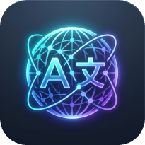

# AI Multi-Translate for VS Code

  

  
  

  <a href="#english">English</a> •
  <a href="#日本語">日本語</a> •
  <a href="#简体中文">简体中文</a> •
  <a href="#한국어">한국어</a> •
  <a href="#tiếng-việt">Tiếng Việt</a> •
  <a href="#deutsch">Deutsch</a> •
  <a href="#español">Español</a> •
  <a href="#français">Français</a> •
  <a href="#हिन्दी">हिन्दी</a> •
  <a href="#italiano">Italiano</a> •
  <a href="#português">Português</a> •
  <a href="#русский">Русский</a>

---

## English

**AI Multi-Translate** is an ultra-fast, modern translation extension for Visual Studio Code. Seamlessly translate code comments, Markdown documentation, strings, and whole files without ever leaving your editor.

Supports **Google Translate (Free, no configuration needed)**, **DeepL API**, and **Google Gemini AI**.

### ✨ Features
- **Instant Out-of-the-box Translation**: Zero configuration needed. Default free engine works immediately!
- **Multi-Engine Support**:
  -  **Free Online Translation** (Google Translate & fallback)
  -  **DeepL API** (Free & Pro tier auth keys)
  -  **Google Gemini AI** (Context-aware, developer-optimized translation)
- **Inline Operations**:
  - **Quick Action Popup**: Translate selection, then choose to replace, insert below, or copy.
  - **Direct Replace**: Replace highlighted text with translation in one click or shortcut (`Cmd+Alt+R` / `Ctrl+Alt+R`).
  - **Insert Below**: Append translation right underneath your code/comment.
- **Full Sidebar Panel**: A dedicated Webview panel with real-time translation, speech synthesis, language swapping, and multi-language UI.
- **Editor Hover Tooltip**: (Enabled by default) View instant translations in tooltips when hovering over selected code.
- **Secure Key Storage**: API keys are securely encrypted using VS Code's native `SecretStorage`.

### ⌨️ Keyboard Shortcuts
| Command | macOS | Windows / Linux | Description |
|---|---|---|---|
| **Translate Selected Text** | `Cmd + Alt + T` | `Ctrl + Alt + T` | Translates selection and opens action picker |
| **Replace Selection** | `Cmd + Alt + R` | `Ctrl + Alt + R` | Replaces selection with translated text |
| **Insert Below Selection** | Context Menu | Context Menu | Inserts translation on the next line |
| **Open Sidebar Panel** | Activity Bar | Activity Bar | Focuses translation side panel |

### 🔑 API Keys & Free Tier Guide

| Provider | Free Tier Available? | How to Get Your API Key |
|---|---|---|
|  **Google Translate** | **100% Free** (No key needed) | Default engine. Zero setup required — works out of the box! |
|  **DeepL API** | **Free tier available** (500,000 chars/month free) | 1. Sign up at [DeepL API Free](https://www.deepl.com/pro-api). 2. Navigate to **Account Settings** and copy your **Authentication Key** (ends with `:fx`). 3. Run `Translate: Set API Key` in VS Code or click ⚙️ in the sidebar panel. |
|  **Google Gemini AI** | **Free tier available** (Free quota in AI Studio) | 1. Sign in to [Google AI Studio](https://aistudio.google.com/) with your Google account. 2. Click **Get API key** -> **Create API key**. 3. Run `Translate: Set API Key` in VS Code or paste into the sidebar settings. |

---

## 日本語

**AI Multi-Translate** は、Visual Studio Code 上で高速かつスマートに翻訳を行うモダンな拡張機能です。エディタを離れることなく、ソースコードのコメント、Markdownドキュメント、エラーメッセージなどを瞬時に翻訳できます。

**Google 翻訳（無料・設定不要）**、**DeepL API**、**Google Gemini AI** の3つのエンジンに対応しています。

### ✨ 主な機能
- **初期設定ゼロですぐに使える**: インストール直後から無料翻訳エンジンで即座に動作。
- **3つの翻訳エンジンに対応**:
  -  **無料オンライン翻訳**（Google 翻訳 & フォールバック）
  -  **DeepL API**（無料版およびPro版の認証キーに対応）
  -  **Google Gemini AI**（コードの文脈を考慮した高精度な翻訳）
- **便利なインライン操作**:
  - **ポップアップ翻訳**: 選択範囲を翻訳し、「置換」「下に挿入」「コピー」を選択可能 (`Cmd+Alt+T` / `Ctrl+Alt+T`)。
  - **ワンキー置換**: 選択中のテキストを翻訳テキストに直接置き換え (`Cmd+Alt+R` / `Ctrl+Alt+R`)。
  - **行下に挿入**: 翻訳結果を原文の直下へコメントとして追記。
- **多機能サイドバーパネル**: 音声読み上げ、言語反転、リアルタイム翻訳、UI言語切り替えに対応した専用Webviewパネル。
- **ホバー翻訳**: デフォルトで有効。選択したテキストにカーソルを合わせるだけで翻訳ツールチップを表示。
- **安全なAPIキー管理**: VS Code標準の `SecretStorage`（OSキーチェーン）によりAPIキーを安全に暗号化保存。

### 🔑 無料枠とAPIキーの発行・設定方法

| プロバイダー | 無料プラン / 無料枠 | APIキーの取得と設定手順 |
|---|---|---|
|  **Google 翻訳** | **完全無料**（キー不要） | デフォルトエンジン。設定不要でインストール直後から利用可能！ |
|  **DeepL API** | **無料プランあり** （月500,000文字まで無料） | 1. [DeepL API 無料登録ページ](https://www.deepl.com/ja/pro-api) で無料アカウントを作成。 2. アカウント設定画面から **認証キー**（末尾が `:fx`）をコピー。 3. VS Codeで `Translate: Set API Key` を実行するか、サイドバーの ⚙️ 設定から登録。 |
|  **Google Gemini AI** | **無料枠あり** （AI Studioで無料利用可能） | 1. [Google AI Studio](https://aistudio.google.com/) にGoogleアカウントでログイン。 2. **「Get API key」** -> **「Create API key」** でキーを作成・コピー。 3. VS Codeで `Translate: Set API Key` を実行するか、サイドバーの ⚙️ 設定から登録。 |

---

## 简体中文

**AI Multi-Translate** 是一款专为 Visual Studio Code 打造的高效智能翻译扩展。无需离开编辑器，即可无缝翻译代码注释、Markdown 文档以及各类文本字符串。

全面支持 **Google 翻译（免费，开箱即用）**、**DeepL API** 以及 **Google Gemini AI**。

### ✨ 主要特性
- **开箱即用**: 无需繁琐配置，默认内置免费引擎立即生效。
- **多引擎支持**:
  - 🌐 **免费在线翻译** (Google 翻译及备用引擎)
  - ⚡ **DeepL API** (支持 Free 和 Pro 授权密钥)
  - 🤖 **Google Gemini AI** (理解开发者语境与代码上下文的智能翻译)
- **快捷行内操作**:
  - **快捷操作面板**: 翻译所选内容后可自由选择替换、插入至下方或复制 (`Cmd+Alt+T` / `Ctrl+Alt+T`)。
  - **一键替换**: 一键将选中文本替换为翻译结果 (`Cmd+Alt+R` / `Ctrl+Alt+R`)。
  - **插入至下方**: 直接在选中文本下方插入译文。
- **全功能侧边栏面板**: 专属 Webview 交互面板，支持实时翻译、语音朗读、语言互换与多语言界面。
- **悬停翻译提示**: 在选中文本上悬停即可快速查看翻译气泡预览。
- **安全存储密钥**: 采用 VS Code 原生 `SecretStorage` 安全加密存储 API 密钥。

---

## 한국어

**AI Multi-Translate**는 Visual Studio Code 사용자를 위한 초고속 스마트 인-에디터 번역 확장 프로그램입니다. 편집기를 벗어나지 않고도 코드 주석, Markdown 문서, 문자열 등을 손쉽게 번역할 수 있습니다.

**Google 번역 (무료, 설정 불필요)**, **DeepL API**, **Google Gemini AI**를 완벽하게 지원합니다.

### ✨ 주요 기능
- **즉각적인 번역 지원**: 별도의 설정 없이 설치 즉시 무료 엔진으로 바로 번역 가능.
- **다중 엔진 지원**:
  - 🌐 **무료 온라인 번역** (Google 번역 및 폴백)
  - ⚡ **DeepL API** (Free 및 Pro 인증 키 지원)
  - 🤖 **Google Gemini AI** (코드 문맥을 이해하는 개발자 친화적 AI 번역)
- **편리한 인라인 작업**:
  - **빠른 작업 팝업**: 선택 영역 번역 후 대체, 아래 삽입, 복사 선택 (`Cmd+Alt+T` / `Ctrl+Alt+T`).
  - **직접 대체**: 선택한 텍스트를 번역문으로 즉시 교체 (`Cmd+Alt+R` / `Ctrl+Alt+R`).
  - **아래 삽입**: 원문 바로 아래 줄에 번역 결과를 추가.
- **다기능 사이드바 패널**: 실시간 번역, 음성 듣기, 언어 맞바꾸기, 패널 UI 다국어 변경을 지원하는 전용 Webview 패널.
- **마우스 호버 툴팁**: 선택한 코드 위에 마우스를 올리면 번역 미리보기를 자동으로 표시.
- **안전한 API 키 관리**: VS Code 자체 `SecretStorage`를 통해 OS 키체인에 안전하게 암호화 저장.

---

## Tiếng Việt

**AI Multi-Translate** là tiện ích dịch thuật thông minh, tốc độ cao dành cho Visual Studio Code. Dịch chú thích mã nguồn, tài liệu Markdown và chuỗi ký tự một cách mượt mà ngay trong trình soạn thảo.

Hỗ trợ **Google Dịch (Miễn phí, không cần cài đặt)**, **DeepL API** và **Google Gemini AI**.

### ✨ Tính năng nổi bật
- **Sử dụng ngay tức thì**: Không cần cấu hình phức tạp, công cụ miễn phí mặc định hoạt động ngay lập tức!
- **Hỗ trợ đa công cụ dịch**:
  -  **Dịch trực tuyến miễn phí** (Google Dịch & hệ thống dự phòng)
  -  **DeepL API** (Hỗ trợ khóa xác thực Free & Pro)
  -  **Google Gemini AI** (Dịch thuật thông minh, hiểu ngữ cảnh lập trình)
- **Thao tác nội dòng tiện lợi**:
  - **Menu thao tác nhanh**: Dịch vùng chọn, sau đó chọn thay thế, chèn xuống dưới hoặc sao chép (`Cmd+Alt+T` / `Ctrl+Alt+T`).
  - **Thay thế trực tiếp**: Thay thế văn bản đã chọn bằng bản dịch chỉ với một phím tắt (`Cmd+Alt+R` / `Ctrl+Alt+R`).
  - **Chèn xuống dòng dưới**: Thêm bản dịch ngay bên dưới vùng văn bản đã chọn.
- **Bảng điều khiển thanh bên**: Giao diện Webview chuyên dụng hỗ trợ dịch theo thời gian thực, đọc phát âm, đảo ngược ngôn ngữ và tùy chỉnh ngôn ngữ giao diện.
- **Xem trước khi di chuột**: (Mặc định bật) Hiển thị tooltip bản dịch ngay khi rê chuột qua đoạn mã được chọn.
- **Bảo mật khóa API**: Khóa API được mã hóa an toàn qua `SecretStorage` gốc của VS Code.

---

## Deutsch

**AI Multi-Translate** ist eine ultraschnelle, moderne Übersetzungserweiterung für Visual Studio Code. Übersetzen Sie Code-Kommentare, Markdown-Dokumentationen und Strings direkt in Ihrem Editor.

Unterstützt **Google Übersetzer (Kostenlos, keine Einrichtung erforderlich)**, **DeepL API** und **Google Gemini AI**.

### ✨ Highlights
- **Sofort einsatzbereit**: Keine Konfiguration notwendig. Die kostenlose Standard-Engine funktioniert sofort!
- **Multi-Engine-Unterstützung**:
  - 🌐 **Kostenlose Online-Übersetzung** (Google Übersetzer & Fallback)
  - ⚡ **DeepL API** (Unterstützung für Free- und Pro-Schlüssel)
  - 🤖 **Google Gemini AI** (Kontextsensitive Übersetzung für Entwickler)
- **Inline-Aktionen**:
  - **Schnellaktions-Popup**: Auswahl übersetzen, dann ersetzen, darunter einfügen oder kopieren (`Cmd+Alt+T` / `Ctrl+Alt+T`).
  - **Direkt ersetzen**: Markierten Text mit einem Tastendruck durch die Übersetzung ersetzen (`Cmd+Alt+R` / `Ctrl+Alt+R`).
  - **Darunter einfügen**: Übersetzung direkt unter dem ausgewählten Code anfügen.
- **Seitenleisten-Panel**: Eigene Webview mit Echtzeitübersetzung, Sprachausgabe und Unterstützung für 12 UI-Sprachen.
- **Hover-Vorschau**: Übersetzung im Tooltip beim Überfahren von ausgewähltem Code anzeigen.
- **Sichere Schlüsselspeicherung**: API-Schlüssel werden über den VS Code `SecretStorage` verschlüsselt gespeichert.

---

## Español

**AI Multi-Translate** es una extensión de traducción moderna y ultrarrápida para Visual Studio Code. Traduce comentarios de código, documentación Markdown y cadenas sin salir del editor.

Compatible con **Google Traductor (Gratuito, sin configuración previa)**, **DeepL API** y **Google Gemini AI**.

### ✨ Características
- **Listo para usar**: Cero configuración necesaria. ¡El motor gratuito predeterminado funciona de inmediato!
- **Soporte multimotor**:
  - 🌐 **Traducción gratuita online** (Google Traductor y respaldo)
  - ⚡ **DeepL API** (Claves para cuentas Free y Pro)
  - 🤖 **Google Gemini AI** (Traducción inteligente adaptada al contexto del código)
- **Operaciones en línea rápidas**:
  - **Ventana emergente de acciones**: Traduce la selección y elige entre reemplazar, insertar abajo o copiar (`Cmd+Alt+T` / `Ctrl+Alt+T`).
  - **Reemplazo directo**: Reemplaza el texto seleccionado con un atajo (`Cmd+Alt+R` / `Ctrl+Alt+R`).
  - **Insertar debajo**: Añade la traducción justo debajo del código seleccionado.
- **Panel lateral completo**: Panel Webview con traducción en tiempo real, síntesis de voz, intercambio de idiomas e interfaz en 12 idiomas.
- **Información al pasar el cursor**: Muestra vistas previas de traducción al posicionar el cursor sobre el texto seleccionado.
- **Almacenamiento seguro**: Las claves de API se guardan cifradas de forma segura mediante `SecretStorage` de VS Code.

---

## Français

**AI Multi-Translate** est une extension de traduction moderne et ultra-rapide pour Visual Studio Code. Traduisez en toute simplicité vos commentaires de code, documents Markdown et chaînes de caractères directement dans l'éditeur.

Prend en charge **Google Traduction (Gratuit, sans configuration)**, **DeepL API** et **Google Gemini AI**.

### ✨ Fonctionnalités
- **Prêt à l'emploi**: Aucune configuration requise. Le moteur gratuit par défaut fonctionne instantanément !
- **Prise en charge multi-moteur**:
  - 🌐 **Traduction gratuite en ligne** (Google Traduction & moteur de secours)
  - ⚡ **DeepL API** (Clés d'authentification Free et Pro)
  - 🤖 **Google Gemini AI** (Traduction intelligente adaptée au contexte du code)
- **Opérations rapides en ligne**:
  - **Menu contextuel rapide**: Traduisez la sélection puis remplacez, insérez en dessous ou copiez (`Cmd+Alt+T` / `Ctrl+Alt+T`).
  - **Remplacement direct**: Remplacez le texte sélectionné par sa traduction en un seul clic ou raccourci (`Cmd+Alt+R` / `Ctrl+Alt+R`).
  - **Insérer en dessous**: Ajoutez la traduction immédiatement sous la ligne sélectionnée.
- **Panneau latéral complet**: Interface Webview dédiée avec traduction en temps réel, synthèse vocale et support de 12 langues d'interface.
- **Info-bulle au survol**: Affichez un aperçu de traduction instantané au survol du code sélectionné.
- **Stockage sécurisé**: Vos clés d'API sont chiffrées de façon sécurisée via `SecretStorage` de VS Code.

---

## हिन्दी

**AI Multi-Translate** विजुअल स्टूडियो कोड (VS Code) के लिए एक बेहद तेज़ और आधुनिक अनुवाद एक्सटेंशन है। अपने एडिटर को छोड़े बिना कोड कमेंट्स, मार्कडाउन दस्तावेज़ों और स्ट्रिंग्स का आसानी से अनुवाद करें।

**Google अनुवाद (मुफ़्त, किसी सेटअप की आवश्यकता नहीं)**, **DeepL API** और **Google Gemini AI** का समर्थन करता है।

### ✨ मुख्य विशेषताएं
- **तुरंत इस्तेमाल के लिए तैयार**: शून्य कॉन्फ़िगरेशन। डिफ़ॉल्ट मुफ़्त इंजन तुरंत काम करता है!
- **मल्टी-इंजन समर्थन**:
  - 🌐 **मुफ़्त ऑनलाइन अनुवाद** (Google अनुवाद और बैकअप इंजन)
  - ⚡ **DeepL API** (Free और Pro ऑथ कुंजियों का समर्थन)
  - 🤖 **Google Gemini AI** (कोड संदर्भ को समझने वाला स्मार्ट AI अनुवाद)
- **सुविधाजनक इन-लाइन ऑपरेशन**:
  - **त्वरित क्रिया पॉपअप**: चयनित टेक्स्ट का अनुवाद करें, फिर बदलें, नीचे डालें या कॉपी करें (`Cmd+Alt+T` / `Ctrl+Alt+T`)।
  - **सीधा प्रतिस्थापन**: शॉर्टकट के साथ चयनित टेक्स्ट को अनुवाद से बदलें (`Cmd+Alt+R` / `Ctrl+Alt+R`)।
  - **नीचे डालें**: चयनित टेक्स्ट के ठीक नीचे अनुवाद जोड़ें।
- **पूर्ण साइडबार पैनल**: वास्तविक समय अनुवाद, टेक्स्ट-टू-स्पीच, भाषा स्वैप और 12 UI भाषाओं के समर्थन वाला समर्पित वेबव्यू पैनल।
- **होवर टूलटिप**: चयनित कोड पर कर्सर ले जाने पर अनुवाद का पूर्वावलोकन देखें।
- **सुरक्षित कुंजी भंडारण**: API कुंजियाँ VS Code के मूल `SecretStorage` द्वारा सुरक्षित रूप से एन्क्रिप्ट की जाती हैं।

---

## Italiano

**AI Multi-Translate** è un'estensione di traduzione ultra-veloce e moderna per Visual Studio Code. Traduci commenti di codice, documentazione Markdown e stringhe senza mai lasciare l'editor.

Supporta **Google Traduttore (Gratuito, nessuna configurazione richiesta)**, **DeepL API** e **Google Gemini AI**.

### ✨ Caratteristiche principali
- **Pronto all'uso**: Nessuna configurazione complessa. Il motore gratuito predefinito funziona immediatamente!
- **Supporto multi-motore**:
  - 🌐 **Traduzione online gratuita** (Google Traduttore e fallback)
  - ⚡ **DeepL API** (Chiavi Free e Pro supportate)
  - 🤖 **Google Gemini AI** (Traduzione intelligente sensibile al contesto del codice)
- **Operazioni in linea rapide**:
  - **Popup di azione rapida**: Traduci la selezione e scegli se sostituire, inserire sotto o copiare (`Cmd+Alt+T` / `Ctrl+Alt+T`).
  - **Sostituzione diretta**: Sostituisci il testo selezionato con la traduzione con una singola scorciatoia (`Cmd+Alt+R` / `Ctrl+Alt+R`).
  - **Inserisci sotto**: Aggiungi la traduzione subito sotto il codice selezionato.
- **Pannello barra laterale completo**: Pannello Webview con traduzione in tempo reale, sintesi vocale e supporto per 12 lingue dell'interfaccia.
- **Tooltip al passaggio del mouse**: Visualizza l'anteprima della traduzione passando il mouse sul codice selezionato.
- **Archiviazione sicura**: Le chiavi API sono crittografate in modo sicuro tramite `SecretStorage` nativo di VS Code.

---

## Português

**AI Multi-Translate** é uma extensão de tradução rápida e moderna para o Visual Studio Code. Traduza comentários de código, documentações Markdown e textos sem sair do editor.

Suporta **Google Tradutor (Gratuito, sem necessidade de configuração)**, **DeepL API** e **Google Gemini AI**.

### ✨ Recursos
- **Pronto para usar**: Zero configuração necessária. O motor gratuito padrão funciona imediatamente!
- **Suporte a múltiplos motores**:
  - 🌐 **Tradução online gratuita** (Google Tradutor & motor alternativo)
  - ⚡ **DeepL API** (Chaves Free e Pro)
  - 🤖 **Google Gemini AI** (Tradução inteligente e contextualizada para desenvolvedores)
- **Operações rápidas no editor**:
  - **Menu de ação rápida**: Traduza a seleção e escolha substituir, inserir abaixo ou copiar (`Cmd+Alt+T` / `Ctrl+Alt+T`).
  - **Substituição direta**: Substitua o texto destacado pela tradução em um único atalho (`Cmd+Alt+R` / `Ctrl+Alt+R`).
  - **Inserir abaixo**: Adicione a tradução logo abaixo do código original.
- **Painel lateral dedicado**: Interface Webview com tradução em tempo real, reprodução de voz, troca de idiomas e suporte a 12 idiomas de interface.
- **Dica de tradução ao passar o cursor**: Veja instantaneamente a tradução em uma dica ao passar o mouse sobre o texto selecionado.
- **Armazenamento seguro de chaves**: As chaves de API são armazenadas com segurança através do `SecretStorage` nativo do VS Code.

---

## Русский

**AI Multi-Translate** — это ультрабыстрое и современное расширение для перевода в Visual Studio Code. Переводите комментарии к коду, документацию Markdown и строковые переменные, не покидая редактор.

Поддерживает **Google Переводчик (Бесплатно, не требует настройки)**, **DeepL API** и **Google Gemini AI**.

### ✨ Основные возможности
- **Работает прямо из коробки**: Никаких сложных настроек. Бесплатный движок по умолчанию доступен сразу после установки!
- **Поддержка нескольких движков перевода**:
  - 🌐 **Бесплатный онлайн-перевод** (Google Переводчик и резервный сервис)
  - ⚡ **DeepL API** (Поддержка ключей Free и Pro)
  - 🤖 **Google Gemini AI** (Интеллектуальный перевод с учетом контекста кода)
- **Быстрые операции в коде**:
  - **Всплывающее меню действий**: Переводите выделенный фрагмент с возможностью замены, вставки ниже или копирования (`Cmd+Alt+T` / `Ctrl+Alt+T`).
  - **Прямая замена**: Мгновенно заменяйте выделенный текст переводом с помощью горячей клавиши (`Cmd+Alt+R` / `Ctrl+Alt+R`).
  - **Вставка ниже**: Добавляйте перевод строкой ниже выделенного кода.
- **Полнофункциональная боковая панель**: Выделенная Webview-パネль с переводом в реальном времени, озвучкой текста, быстрой сменой языков и поддержкой 12 языков интерфейса.
- **Перевод при наведении**: Всплывающая подсказка с переводом при наведении курсора на выделенный фрагмент кода.
- **Безопасное хранение ключей**: Ключи API надежно шифруются с помощью встроенного хранилища `SecretStorage` VS Code.

---

## 📄 License

MIT © [GlobalPaws](https://github.com/GlobalPaws)
